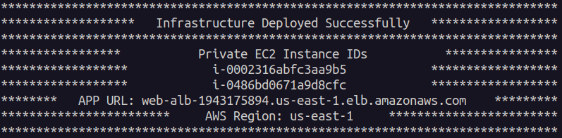
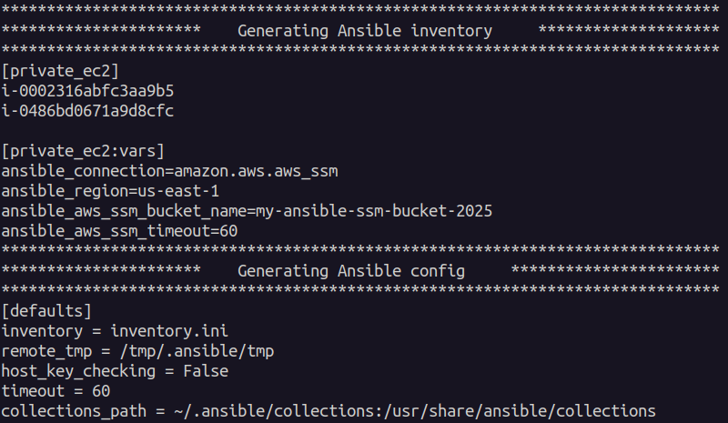
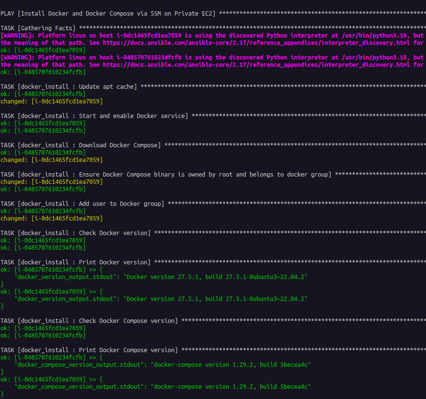
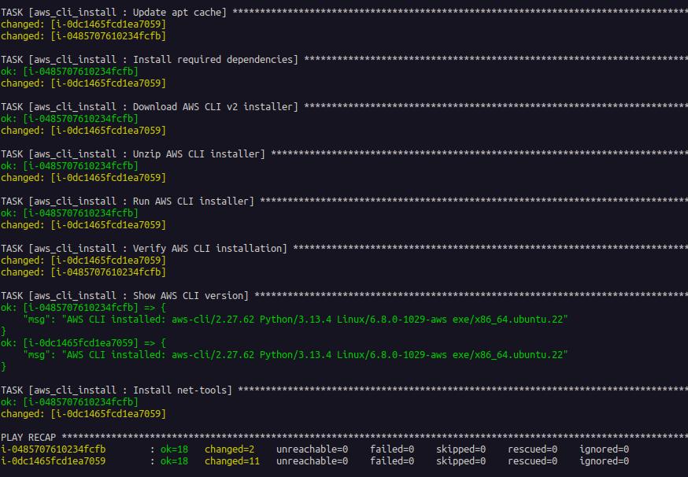
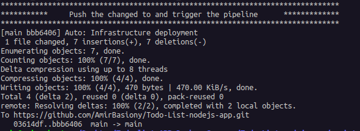
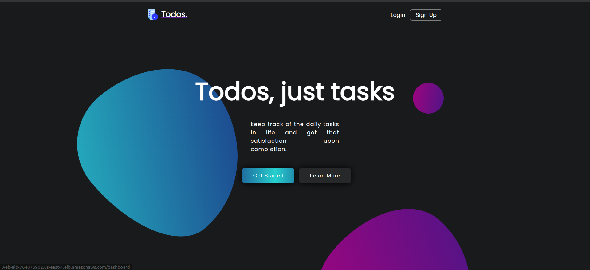
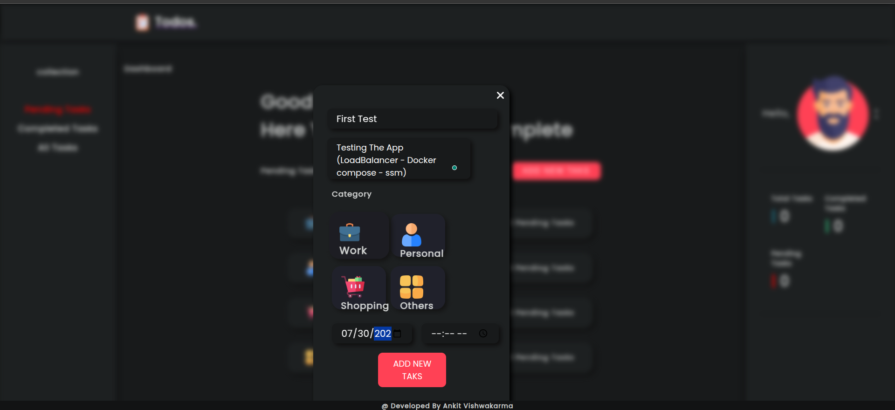
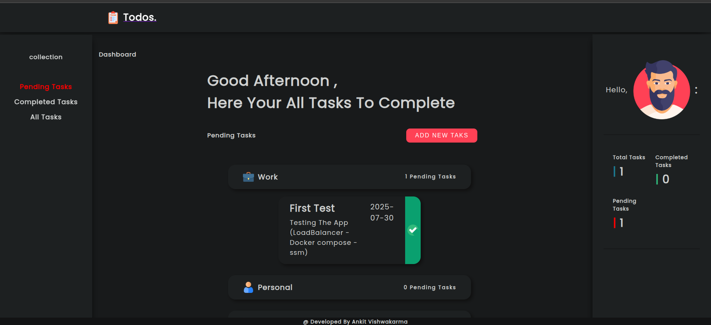
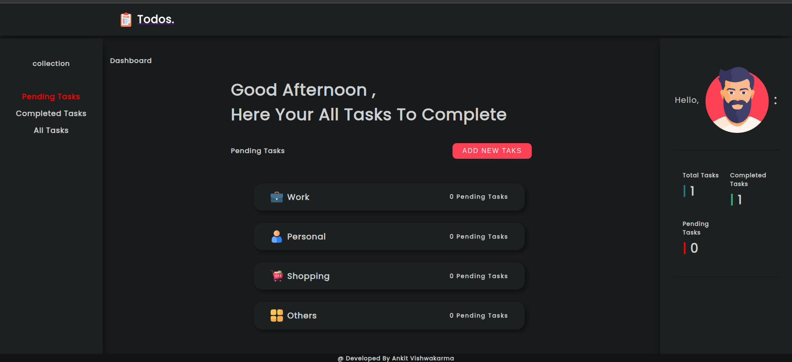

# 📘 Todo List Node.js Application Documentation

---

## 📦 Application Overview

A full-stack, containerized To-Do List application using **Node.js**, **Express.js**, **MongoDB**, **Docker**, deployed on **private EC2** instances using **AWS SSM**, **GitHub Actions**, **Terraform**, and **Ansible**. The app is accessed through an Application Load Balancer (**ALB**) in a public subnet.

It offers features like `creating`, `editing`, `completing`, and `deleting` to-do items.

---

## Table of Contents

* [Tech Stack](#tech-stack)
* [Project Architecture](#project-architecture)
* [Running the Application Locally](#running-the-application-locally)
* [Running with Docker and Docker Compose](#running-with-docker-and-docker-compose)
* [Architecture Diagram](#architecture-diagram)
* [Infrastructure Architecture](#infrastructure-architecture)
* [Deploying to AWS](#deploying-to-aws)
* [CI/CD Pipeline](#cicd-pipeline)
* [Access the Application](#access-the-application)
* [Destroying the Infrastructure](#destroying-the-infrastructure)
* [Final Notes](#final-notes)


---

## Tech Stack

* **Frontend/Backend**: Node.js, Express.js, EJS, CSS
* **Database**: MongoDB with Mongoose
* **Containerization**: Docker, Docker Compose
* **Infrastructure as Code**: Terraform
* **Configuration Management**: Ansible
* **CI/CD**: GitHub Actions
* **Cloud Provider**: AWS (EC2, SSM, ECR, ALB, VPC, IAM)

---

## Project Architecture

```bash
Todo-List-nodejs-app
├── Ansible_Rules/         # Ansible roles to install Docker, AWS CLI on EC2
├── assets/                # Static assets (CSS & JS)
├── config/                # MongoDB configuration
├── controllers/           # Route handling logic
├── docker-compose.yml     # Docker container definitions
├── Dockerfile             # Node.js app Dockerfile
├── models/                # MongoDB schemas
├── routes/                # Express routing
├── scripts/               # Automation scripts for infra
├── terraform/             # Terraform IaC definitions
├── views/                 # EJS frontend templates
├── Project_Stages_Images/ # Diagrams and screenshots
├── .github/workflows/     # GitHub Actions workflows
├── index.js               # App entry point
├── package.json           # Project metadata and dependencies
```

---

## Running the Application Locally

### 1. Clone the repo

```bash
git clone https://github.com/AmirBasiony/Todo-List-nodejs-app.git
cd Todo-List-nodejs-app
```

### 2. Install dependencies

```bash
npm install
```

### 3. Start MongoDB

Ensure MongoDB is running locally or accessible remotely.

### 4. Run the app

```bash
npm start
# or with nodemon
dev: nodemon index.js
```

Visit: [http://localhost:4000](http://localhost:4000)

---

## Running with Docker and Docker Compose

**To containerize and run the app:**

- build the docker image
    ```bash
    docker build -t `todo-app-image` .
    ```
- Edit the image name to `todo-app-image` in the `docker-compose.yaml` file
- Start the Application 
    ```bash
    docker-compose up --build
    ```

Then open: [http://localhost:4000](http://localhost:4000)

---


## Architecture Diagram

```
                          +-------------------------------+
                          |   Terraform Infrastructure    |
                          | (VPC, Subnets, ALB, EC2, SSM) |
                          +-------------------------------+
                                        |
                                        ▼
              +--------------------------------------------------+
              |     EC2 Instances in Private Subnet (via SSM)    |
              |  - Docker Engine & AWS CLI installed via Ansible |
              |  - App runs with docker-compose                  |
              +--------------------------------------------------+
                                        | Push the Changes
                                        ▼                                                               
                              +---------------------+
                              |     GitHub Repo     |
                              +---------------------+
                                        | Trigger the Pipeline
                                        ▼
                            +-------------------------+
                            | GitHub Actions Pipeline |
                            +-------------------------+
                                        ▲
                                        |
                             +--------------------+
                             |  Application Load  |
                             |     Balancer (ALB) |
                             +--------------------+
                                        |
                                        ▼
                           Accessible via ALB Public DNS
```

---

## Infrastructure Architecture

Managed with `Terraform` and configured with `Ansible`.

### 🏗️ Steps

1. **Terraform** provisions the entire infrastructure:

   * VPC, Internet Gateway, Route Tables
   * Public & Private Subnets
   * Security Groups
   * ALB (public subnet) and EC2 (private subnet)
   * IAM roles and policies for SSM and EC2 access

2. **EC2 Instances** are launched in a **private subnet**, with:

   * No public IPs
   * Only accessible through **AWS Systems Manager (SSM)**

3. **Ansible** is executed via the `setup.sh` script:

   * Connects to EC2 instances through SSM
   * Installs Docker and AWS CLI
   * Prepares environment for Dockerized deployment

---

## Deploying to AWS

### **Prerequisites**

1. **Set AWS Account Configuration**  
   Run the following command on your localhost to configure your AWS account:  
   ```bash
   aws configure
   ```
   When prompted, provide the following details:  
   - `AWS Access Key ID` (e.g., your_access_key_id)  
   - `AWS Secret Access Key` (e.g., your_secret_access_key)  
   - `Default region name` (e.g., us-east-1)  
   - `Default output format` (leave blank or type `json`)

2. **Set Up GitHub Actions CI/CD secrets**:
   - `AWS_ACCESS_KEY_ID`
   - `AWS_SECRET_ACCESS_KEY`
   - `AWS_DEFAULT_REGION`
   - `AWS_ACCOUNT_ID`

### Step 1: Provision Infrastructure
```bash
cd scripts/
./infra_build_configure.sh "Auto: Infra & Configure"
```
---
### This script will:
---
1- Build the infrastructure using Terraform.
  - The Extract EC2 IDs, region, ALB DNS After Building the infrastructure.



2- Prepare `inventory.ini` and `ansible.cfg`


3- Run Ansible playbook over AWS SSM to configure EC2s with **Docker** and **AWS CLI**.
  - Installing Docker:  
  

  - Installing AWS CLI:  



4- Push changes to GitHub triggering the CI/CD pipeline


---
### Detailed Infrastructure Diagram


### Step 2: Access the App

Visit the URL output by Terraform:

```text
http://<ALB_DNS_NAME>
```

---

## CI/CD Pipeline

### Trigger

* On push to `main` branch

### Pipeline Stages

#### 1️⃣ Get EC2 Instance IDs

* Fetches Terraform outputs for EC2 IDs and ALB DNS

#### 2️⃣ Build & Push Docker Image to ECR

* Builds image using GitHub run number
* Pushes to:

```
${{ secrets.AWS_ACCOUNT_ID }}.dkr.ecr.${{ secrets.AWS_DEFAULT_REGION }}.amazonaws.com/todo-nodejs-app
```

#### 3️⃣ Deploy via SSM to EC2

* Uploads `.env` and `docker-compose.yml`
* Sends SSM Run Command to run:

```bash
docker-compose down && docker-compose up -d
```


### Access the Application







---

## Destroying the Infrastructure

```bash
cd scripts/
./infra_destroy.sh
```

Cleans up all AWS resources via `terraform destroy`.

---

## Final Notes

This project demonstrates:

* Scalable infrastructure using Terraform
* Secure EC2 provisioning via Ansible + AWS SSM (no SSH)
* CI/CD automation via GitHub Actions
* Dockerized deployment to private EC2s
* Public access through ALB only

Use `scripts/infra_destroy.sh` to clean up.

Check GitHub Actions or AWS SSM logs for debugging.

---

🧑‍💻 Developed by **Amir Basiony**
📨 [LinkedIn](https://www.linkedin.com/in/amir-elbasiony-57809b204/)
